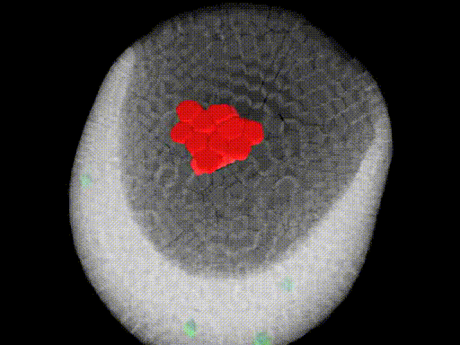
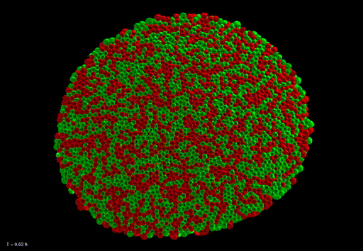

## From Cell Behavior to Embryonic Morphogenesis

This repository contains the online manuscript of the my PhD dissertation defended in 2013 (**[Click here to access it](https://juliendelile.github.io/PhD_manuscript/manuscript/pragma/manuscript.html?user=regular&section=toc)**):

*From Cell Behavior to Embryonic Morphogenesis: Mechanogenetic Modeling and Computational Simulation of Early Animal Development*

The thesis introduces most of the concepts behind the **MecaGen** model ([repository](https://github.com/juliendelile/MECAGEN), [article](https://doi.org/10.1038/ncomms13929)), a model of animal morphogenesis construed as a self-organized phenomenon emerging from a complex system made of a myriad of individual cellbehaviors. It is implemented in an agent-based simulation centered on the mechanic-chemical coupling between cellular and genetic dynamics. The thesis also contains a set of specific studies of the different phases of Zebrafish embryonic development.

This project was developed under the supervision of Nadine Peyriéras and [René Doursat](http://doursat.free.fr/) at [CNRS](http://www.cnrs.fr/en/) and [ISC-PIF](https://iscpif.fr/?lang=en).

### Highlights

Some of the highlights include:

* individual cell migration toward a population emitting a diffusing signal

| | |
:-------------------------:|:-------------------------:
  |  

* classic and new mechanisms leading to cell sorting

| | | |
:-------------------------:|:-------------------------:|:-------------------------:
  |    |  

* cases studies of the different phases of early Zebrafish development (first video taken from [Karlstrom & Kane](https://pubmed.ncbi.nlm.nih.gov/9007263/) for illustration)

| | | |
:-------------------------:|:-------------------------:|:-------------------------:
  |    |  
  |    |  
  |    |  

A few state-of-the-art sections may also be of interest, they comprise:

* a historical timeline of Developmental Biology
* a review of the different types of biomechanical models
* a review of the Zebrafish early developmental mechanics

### Table of Content

1. Introduction

	1. A Historical Timeline of Developmental Biology
  
		1. The Science of How Organisms Form
		2. First Theories: Epigenesis, Preformation and Spontaneous Generation
		3. The Rise of Experimental Embryology
		4. Developmental Genetics
		5. Molecular Genetics
		6. Cell Biomechanics

  2. Integrating Developmental Mechanics and Genetics: The MECAGEN Project
	
  3. Methodological Considerations
		1. The Scientist in the Observation-Hypothesis-Experiment Loop
		2. Designing Tools to Perceive, Conceive and Manipulate
		3. Reality Check: Validating the Hypotheses
	
  4. Overview of this Dissertation

*PART I: A GENERIC MODEL OF MULTICELLULAR DEVELOPMENT*

2. State of the Art and Principles of Embryo Development Models

	1. A Review of Theoretical Models of Development
		
		1. Early Attempts
		2. Reaction-Diffusion Systems
		3. Morphogen Gradients and Positional Information
		4. Epithelial Cell Shaping and Division Patterns
		5. Differential Adhesion and Cell Sorting

	2. Common Modeling Principles: Toward an Integrated Theory of Development

		1. Dealing with Multiple Levels of Organization
		2. Relating One Level to the Next: The Problem of Emergence
		3. Identifying Custom Laws at Each Level
		4. Summary Table

	3. Overview of the MECAGEN Modeling Principles

3. MECAGEN Model of Cell Biomechanics

	1. State of the Art in Biomechanical Modeling

		1. The Many Viewpoints on "Soft Matter": From Continuous-Space to Discrete-Element Models
		2. Particle-Based Physics
	2. Hypotheses

		1. Generic Cell-Centered Equation of Motion
		2. Cell Neighborhood
		3. Interaction Potential
		4. Cell Specific Behavioral Forces

4. MECAGEN Model of Molecular and Genetic Regulation and Signaling

	1. Intra-Cellular Gene/Protein Reactions
		
		1.1. Protein-Protein Interactions
		1.2. Synthesis by Encoding Genes
		1.3. Degradation by the Molecular Environment
		1.4. Cis-Regulatory Boolean Model of Gene Expression

	2. Signal Secretion and Transduction Modules

		1. Signal Secretion Module
		2. Signal Transduction Module

	3. Extra-Cellular Reactions, Transport and Diffusion
	
	4. Illustration on Artificial GRN Motifs

5. MECAGEN Model of Mechanic-Genetic Coupling
	
	1. Toward a Cell Behavior Ontology

		1. Cell Behavior Ontology
		2. Mechanotransduction Input of the GRN
		3. Cell Adhesion
		4. Cell Polarization

	2. Waddingtonian Timeline Specification

		1. Cell Types
		2. Ligand Sinks and Sources
		3. Passive Force's Adhesion Modulation
		4. Active Cell Behavior Specification

	3. Illustration on Artificial Cell Sorting

		1. Cell Sorting: Revisiting a Classical Problem
		2. Individual Cell Migration

*PART II: STUDY OF THE ZEBRAFISH EARLY EMBRYOGENESIS*

6. Review of the Zebrafish Early Developmental Mechanics

	1. Cleavage Stages, Formation of the EVL and YSL

		1. The Formation of the Enveloping Cell Layer
		2. The Formation of the Yolk Syncitial Layer

	2. Blastula Stages and the Onset of Epiboly
	
	3. Gastrulation Movements

		1. Epiboly Phase Two
		2. Hypoblast Formation
		3. Convergence-Extension

7. Experimental Reconstruction of the Zebrafish Early Development

	1. Bioemergences Reconstruction Workflow
		
		1. Embryo Preparation and Acquisition
		2. Cell Lineage Reconstruction Workflow
		3. Post Processing and Exploitation

	2. Reconstructing In Toto Deformation Fields

		1. Manual Registration
		2. Voxel Quality Evaluation
		3. Blending Function
		4. Deformation Fields
		5. Blended Deformation Fields

8. Simulated Reconstruction and Model Validation Through Case Studies

	1. Investigating the Yolk Biomechanical Properties

		1. Hypotheses and Model
		2. Simulation, Parameter Space and Validation
		3. Discussion

	2. Cell Proliferation Rate Along the Cell Lineage

		1. Hypotheses and Model
		2. Simulation, Parameter Space and Validation
		3. Discussion
	
	3. Shaping the Zebrafish Blastula

		1. Hypotheses and Model
		2. Simulation, Parameter Space and Validation
		3. Discussion

	4. Cell Behaviors in the Enveloping Cell Layer Compartment
		
		1. Hypotheses and Model
		2. Simulation, Parameter Space and Validation
		3. Discussion

	5. Intercalation Patterns

		1. Hypotheses and Model
		2. Simulation, Parameter Space and Validation
		3. Discussion

	6. Gastrulation

		1. Hypotheses and Model
		2. Simulation, Parameter Space and Validation
		3. Discussion

9. Conclusion

	1. Criteria for a "Good" Model

		1. Similarities between Variables and Concepts
		2. Computational Feasibility

	2. Choices Concerning the Biomechanics

		1. Spatial Neighborhood
		2. Interaction Potential and Behavioral Forces  
		3. External Objects
		4. Single-Cell vs. Subcellular Mechanics
		5. Spherical-Voronoi Approximation

	3. Choices Concerning the Molecular/Genetic Regulation and Signaling

	4. Assessment of the Case Studies

	5. Future Work

		1. Portability to Other Animal Models
		2. Interactive Exploration of Parameter Space
		3. Toward an "Evo-Devo" Perspective
